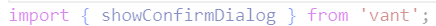

## 测试中出现的典型错误

#### 1. 引用了未定义的函数或者变量

这个`showToast`是一个函数，但是没有定义，因为从来没有调用过，所以没有发现问题

 

 

 

#### 2. 变量使用错误

这个`globalSDT`是一个全局变量，正确的使用方式应该是`this.$store.state.globalSDT`

 

 

### 3. 一些拼写错误

这个`fronUserName`正确的拼写应该是`fromUserName`，错误的拼写导致赋值失败

 

 